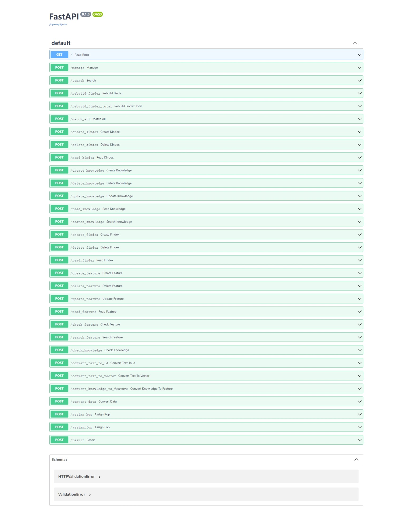
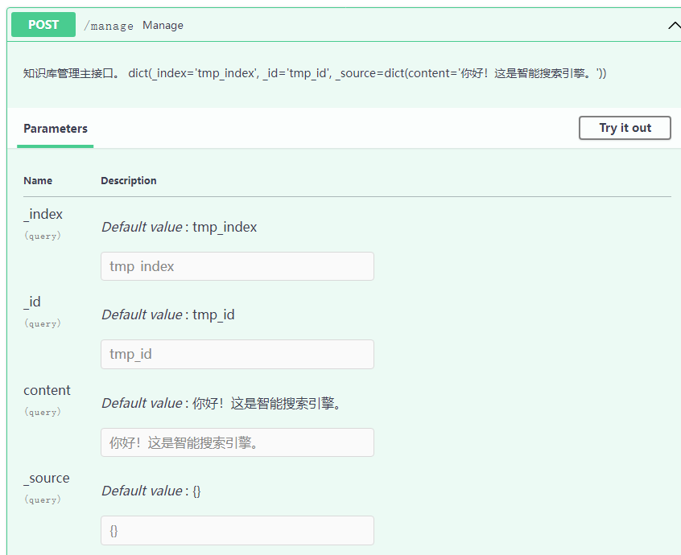
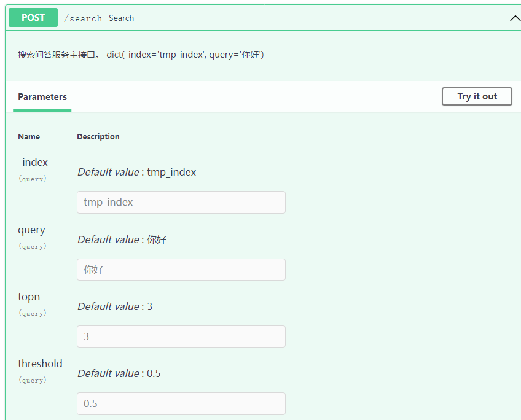

# esman

elasticsearch manager，基于Elasticsearch的知识库管理和搜索的后端平台，支持向量搜索和ES搜索的融合，赋能智能问答、RAG、AI搜索。

## 接口

部署服务后，进入接口文档地址查看各个接口服务的用法。

### 接口文档

- docs: http://127.0.0.1:8080/docs
- redoc: http://127.0.0.1:8080/redoc

### Docs



### 核心接口

#### Manage

知识库管理主接口。 

地址：http://127.0.0.1:8080/manage



#### Search

搜索问答服务主接口。 

地址：http://127.0.0.1:8080/search




## 部署

推荐使用docker-compose部署，若使用其他部署方式，可以参考[docker-compose.yml](docker-compose.yml)的指引进行部署。

### 方式1：用docker-compose部署（推荐）

先自行安装docker和docker-compose，然后可用`docker-compose --help`查看相关命令，用例如`docker-compose up --help`查看相关命令的参数。

```shell
### 开启服务
docker-compose up -d --force-recreate --build

### 查看日志
docker-compose logs -f

### 关闭服务
docker-compose down
```

### 方式2：用docker部署

1. 部署esman

```shell
### 创建镜像
docker build -t esman:v0.1 .

### 部署容器
docker run -id --name esman --net elastic -p 8080:8080 -e "ES_URL=http://127.0.0.1:9200" -e "ES_INDEX_FREQ=esman-MONTHLY" -t esman:latest
```

2. 部署elasticsearch（没有挂载数据卷，数据不能长期保存）

```shell
### 确定版本
version=8.12.2
# python里用8.12.1的elasticsearch包

### 第1步：ES docker部署
docker network create elastic
docker pull docker.elastic.co/elasticsearch/elasticsearch:$version
docker run -id --name elasticsearch --net elastic -p 9200:9200 -p 9300:9300 -e "discovery.type=single-node" -e "xpack.security.enabled=false" -e "xpack.security.http.ssl.enabled=false" -t docker.elastic.co/elasticsearch/elasticsearch:$version

### 第2步：Kibana docker部署
# **注意：Kibana版本与ES保持一致**

docker pull docker.elastic.co/kibana/kibana:$version
docker run --name kibana --net elastic -p 5601:5601 docker.elastic.co/kibana/kibana:$version
```
